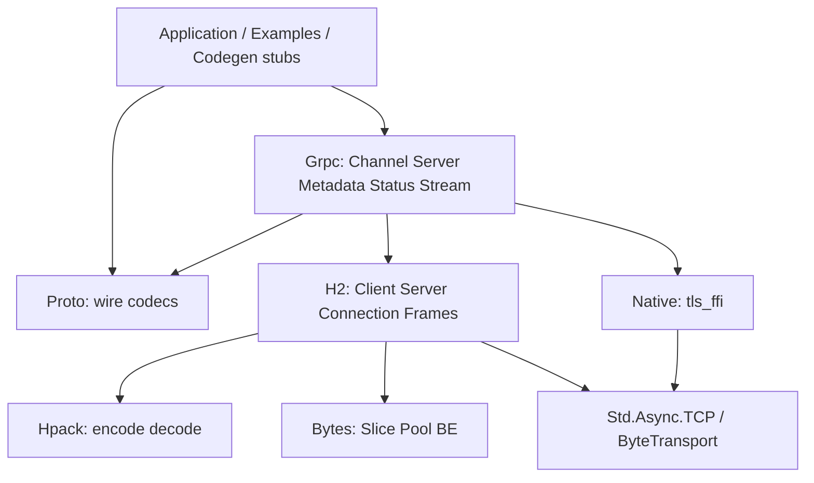

# Architecture

lean-grpc is a layered Lean 4 library: bytes → HPACK → HTTP/2 → gRPC application APIs, with in-process OpenSSL TLS via a small native FFI.



## Packages

| Lake lib | Role |
|---|---|
| `Bytes` | Slice views, big-endian helpers, buffer pooling for hot paths |
| `Hpack` | HTTP/2 header compression (static/dynamic table, Huffman) |
| `H2` | HTTP/2 connection state machine, framing, flow control, h2c listen/dial |
| `Proto` | Minimal protobuf wire codec + interop / helloworld message types |
| `Grpc` | gRPC semantics on top of H2: channels, servers, credentials, LB, xDS, ops |
| `Proofs` | Compile-time theorems over pure codecs/maps (not a consumer dependency) |

Executables (examples, interop, benches, codegen plugin) sit outside the libraries and `import Grpc`. The `Proofs` library typechecks in CI via `lake build Proofs`; see [proofs.md](proofs.md).

## Client path

1. **`Channel.dial` / `connectH2c`** — parse target (`host:port`, `dns:///…`, `xds:///…`), resolve addresses, pick via balancer, open `H2.ClientConn` (h2c or TLS transport).
2. **`Channel.unary`** — apply call credentials → build request headers (`:method POST`, `:path`, `content-type`, `te: trailers`, `user-agent`, optional `grpc-timeout` / `grpc-encoding`) → length-prefix encode body → `H2.Client.startRequest` / `awaitResponse`.
3. **Response** — decode headers/trailers into `Status` (including HTTP non-200 / RST_STREAM mapping), inflate message if compressed, enforce max receive size.
4. **Retry / hedge** — service config may retry status codes with backoff, or launch parallel hedges and RST losers.
5. **Keepalive** — idle PING; unanswered PING → GOAWAY and reconnect.

Streaming uses `Channel.openStream` → `Grpc.Stream` writer/reader over the same connection.

## Server path

1. **`Server.serveH2c` / `serveTls`** — accept TCP (or TLS listener), run HTTP/2 preface + SETTINGS.
2. **`handlerFor`** — on each stream: parse path / content-type / timeout / encodings; reject bad content-type with **HTTP 415**; trailers-only for unimplemented / zero deadline.
3. Dispatch unary or streaming handler; encode response messages; send headers + DATA + trailers (`grpc-status` / `grpc-message` / optional `grpc-status-details-bin`).

Health, reflection, and channelz are ordinary registered methods (`Grpc.Health`, `Grpc.Reflection`, `Grpc.Channelz`).

## Transport abstraction

`H2.ByteTransport` is a small send/recv interface. Implementations:

- Plain TCP (`H2.Client.connectH2c`, `H2.Server.listenH2c`)
- In-process OpenSSL ALPN `h2` (`Grpc.Native.Tls` → `Tls.connectH2` / `serveH2`)
- Optional sidecar via `LEAN_GRPC_TLS_PROXY` (client dials h2c to a local terminator)

## Credentials

```text
DialOptions
├── ChannelCredentials.insecure | .tls Config
└── CallCredentials?  (Bearer / JWT / OAuth / ADC / composite)
```

ADC (`Grpc.Adc`) fetches a token (service-account JWT exchange or GCE metadata) and injects `authorization: Bearer …`. Live Google calls need real credentials; CI uses `scripts/mock-adc-server.py`.

## Discovery and load balancing

```text
target
  ├── dns:/// / host:port → Resolver.resolve (getent / env override)
  └── xds:///name → XdsAds (LDS→RDS→CDS→EDS over ADS; FakeAds in CI)
         ↓
Balancer.pick_first | round_robin  (per-RPC pick for RR)
         ↓
connectAddr → pooled ClientConn
```

`Grpc.Grpclb` is a thin legacy `BalanceLoad` client shim; xDS is preferred for mesh-style discovery.

## Observability hooks

| Module | Role |
|---|---|
| `Grpc.BinaryLog` | In-memory header/message/trailer events |
| `Grpc.Stats` | Counters + Prometheus-style / OTel-stub export |
| `Grpc.Interceptor` | Client/server unary middleware chains |
| `Grpc.Orca` | Per-RPC and out-of-band load reports |

These are intentionally lightweight compared to full OpenTelemetry SDKs.

## Process / concurrency model

- Networking uses Lean 4 `Std.Async` (libuv-backed). Prefer one event-loop owner per process for listen/accept.
- Interop loopbacks that need a second peer often **spawn a child executable** (e.g. `trailersLoopback`) instead of sharing one UV loop across conflicting `.block` tasks.
- CI runs multi-language peers as separate processes (Go / Python / h2spec).

## Native code

| Artifact | Purpose |
|---|---|
| `native/tls_ffi.c` | OpenSSL client/server with ALPN `h2`, optional mTLS — linked into `Grpc` |
| `native/zlib_helper.c` (optional) | Process helper for peer gzip; not linked into Lean |
| `native/zlib_bridge.c` | Reference/source only — **not** linked via Lake |

`Grpc` links `tls_ffi.o` with `-lssl -lcrypto`. Peer compression uses helpers / system `gzip` / stored-deflate fallbacks (see [packaging.md](packaging.md)).

## Non-goals (current)

- HTTP CONNECT / corporate HTTP_PROXY tunneling
- ALTS / GCE channel credentials (allowlisted in `Grpc.Gcp`)
- Full Google protobuf runtime / gRPC-Web / Connect-RPC
- End-to-end formal verification of TLS/FFI/async sessions (pure codec proofs only; [proofs.md](proofs.md))

See [protocol-mapping.md](protocol-mapping.md) and [conformance.md](conformance.md) for wire and parity details.
