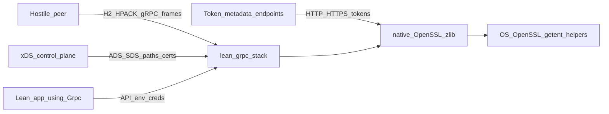

# lean-grpc cybersecurity & vulnerability review (2026-08)

**Scope:** Full stack — Lean wire parsers, native OpenSSL/zlib FFI, ADC/JWT credentials, xDS/SDS, ops surfaces, codegen, CI/supply-chain, Python/Go interop helpers.  
**Method:** Threat-model-driven static audit + targeted dynamic PoCs (compression bomb under ASAN; code-path verification).  
**Baseline:** package tip matching this review date; docs [SECURITY.md](../SECURITY.md), [conformance.md](conformance.md), [tls-envoy.md](tls-envoy.md), [packaging.md](packaging.md).  
**Out of scope:** ALTS / GCE channel credentials / HTTP CONNECT (allowlisted); live Google ADC without credentials; end-to-end formal verification of TLS/FFI/async sessions (pure codec theorems live under `Proofs/` — see [proofs.md](proofs.md)); in-tree code fixes (tracked as remediation backlog below).

---

## 1. Executive summary

lean-grpc is a young Lean 4 gRPC stack with strong **wire conformance gates** (h2spec, interop, stress demos) and useful **documented insecure escapes**. The review found **no confirmed remote memory-corruption RCE** in Lean code, but several **High** issues that break intended confidentiality/integrity for TLS and ADC, and **unauthenticated DoS** paths against hostile peers.

**Top residual risks for production use today:**

1. ADC token HTTPS exchange and empty-CA TLS dial **disable certificate verification** (MITM).
2. Even with a CA loaded, **hostname verification is missing**.
3. **gzip/deflate bombs** expand past `maxMsgSize` (verified: 20 MiB from ~20 KiB compressed under ASAN with no output cap).
4. HTTP/2 **receive flow control** and **header-list size** are not enforced → memory DoS.
5. xDS ADS/grpclb speak **cleartext h2c**; SDS API accepts **arbitrary filesystem paths** from the control plane.

**Verdict:** Suitable for localhost / mesh-with-external-TLS experiments with defense in depth. **Not yet suitable** as a standalone internet-facing gRPC stack without remediating P0/P1 items and terminating TLS/auth at a trusted sidecar or fixing in-process verify paths.

---

## 2. Threat model

### 2.1 Assets

| Asset | Sensitivity |
|---|---|
| Service-account private keys / PEM | Critical |
| OAuth / GCE access tokens | Critical |
| TLS private keys (server/client mTLS) | Critical |
| Application RPC payloads & metadata | High |
| Process internals (reflection, channelz, binary log) | Medium–High |
| CI / build integrity | High |

### 2.2 Actors & trust boundaries



| Boundary | Trust assumption |
|---|---|
| Network peer (h2c or TLS) | **Untrusted** |
| xDS management server | **Fully trusted** once dialed (today: cleartext) |
| Token / metadata HTTP(S) endpoints | Must be authentic; **broken by VERIFY_NONE** |
| Process environment | Trusted admin; env overrides are powerful |
| System OpenSSL / zlib / `getent` / helper binaries | Trusted OS components |
| protoc plugin stdin / `.proto` | Untrusted if attacker can invoke the plugin |

### 2.3 Environment-gated insecure modes

| Variable | Effect | Production stance |
|---|---|---|
| `LEAN_GRPC_TLS_INSECURE_FALLBACK=1` | Skip TLS → h2c | Never |
| `LEAN_GRPC_TLS_PROXY` | Dial h2c to local terminator | Trust the sidecar only |
| `LEAN_GRPC_TOKEN_INSECURE=1` | ADC token over cleartext HTTP | Tests only |
| `LEAN_GRPC_TOKEN_HOST` / `TOKEN_PATH` | Redirect token exchange | Tests only |
| `LEAN_GRPC_GCE_METADATA` | Redirect metadata host | Tests only |
| `LEAN_GRPC_RESOLVE_ADDRS` | Override all DNS resolution | Tests only |
| `LEAN_GRPC_XDS_BOOTSTRAP` | ADS bootstrap path | Protect file + CP |
| `LEAN_GRPC_ZLIB_HELPER` / `DEFLATE_HELPER` | Exec external filter | Absolute allowlist only |
| `GOOGLE_APPLICATION_CREDENTIALS` | SA JSON path | Secret |

Empty `caPath` on dial is an **API-level** insecure default (encrypted but unauthenticated TLS), not only an env flag.

### 2.4 Out of scope (documented)

- ALTS and GCE channel credentials (`Grpc.Gcp.deferredCases`)
- HTTP CONNECT proxying
- Live Google ADC (manual `scripts/run-adc-live.sh` only)

---

## 3. Severity rubric

| Severity | Criteria |
|---|---|
| Critical | Remote memory corruption, auth bypass of intended TLS/ADC trust with silent production defaults, private-key/token exfil without opt-in |
| High | Unauthenticated DoS (OOM/CPU) from peer; TLS verify disabled on sensitive paths; path/command injection |
| Medium | Insecure knobs / weak validation with realistic exploit path; info disclosure |
| Low | Defense-in-depth gaps, hygiene |
| Informational | Known limitations, design notes |

---

## 4. Findings

IDs are stable for tracking (`LGSEC-YYYY-NN`).

### Critical / High

#### LGSEC-2026-01 — ADC `httpsPost` disables TLS certificate verification
| | |
|---|---|
| **Severity** | **High** (Critical if SA JWT assertion is posted on hostile networks) |
| **CWE** | CWE-295 |
| **Location** | [`native/tls_ffi.c:489`](../native/tls_ffi.c); caller [`Grpc/Adc.lean:119`](../Grpc/Adc.lean) |
| **Impact** | MITM completes handshake with any cert; steals JWT assertion or forges `access_token`. |
| **Evidence** | `SSL_CTX_set_verify(ctx, SSL_VERIFY_NONE, NULL);` with no CA load and no hostname check. |
| **Remediation** | System/default verify paths + `SSL_VERIFY_PEER` + `SSL_set1_host`; fail closed. |

#### LGSEC-2026-02 — Empty CA on TLS dial → `SSL_VERIFY_NONE`
| | |
|---|---|
| **Severity** | **High** |
| **CWE** | CWE-295 |
| **Location** | [`native/tls_ffi.c:137–146`](../native/tls_ffi.c); [`native/tls_bridge.c:29–35`](../native/tls_bridge.c); [`Grpc/Tls.lean:47`](../Grpc/Tls.lean) |
| **Impact** | Default `caPath := none` yields encrypted-but-unauthenticated channels. |
| **Remediation** | Default to system trust store; require explicit `insecureSkipVerify` opt-in distinct from “empty path”. |

#### LGSEC-2026-03 — No hostname verification when CA is set
| | |
|---|---|
| **Severity** | **High** |
| **CWE** | CWE-297 |
| **Location** | [`native/tls_ffi.c:143–164`](../native/tls_ffi.c) (SNI set; no `SSL_set1_host`) |
| **Impact** | Any cert signed by the configured CA (wrong SAN) is accepted. |
| **Remediation** | `SSL_set1_host(ssl, sni_or_host)` after enabling peer verify. |

#### LGSEC-2026-04 — Unbounded zlib decompress (compression bomb)
| | |
|---|---|
| **Severity** | **High** |
| **CWE** | CWE-409 / CWE-400 |
| **Location** | [`native/zlib_bridge.c:44–85`](../native/zlib_bridge.c); helpers [`native/zlib_helper.c`](../native/zlib_helper.c); Lean order [`Grpc/Server.lean:127–156`](../Grpc/Server.lean), [`Grpc/Message.lean:60–78`](../Grpc/Message.lean) |
| **Impact** | Peer sends Compressed-Flag frame under wire `maxMsgSize`; inflate grows without native cap → OOM. Streaming paths skip post-inflate size check. |
| **Dynamic evidence** | Standalone ASAN build mirroring `lean_grpc_gzip_decompress`: **20 485 B → 20 971 520 B** uncompressed, under 4 MiB wire limit. Python PoC: 50 MiB zeros → ~51 KiB gzip. |
| **Remediation** | Pass max output into C inflate; abort when exceeded; enforce in `Message.decode*` for all RPC kinds. |

#### LGSEC-2026-05 — `http_post` / `https_post` snprintf truncation → stack over-read
| | |
|---|---|
| **Severity** | **High** |
| **CWE** | CWE-126 |
| **Location** | [`native/tls_ffi.c:430–436`](../native/tls_ffi.c), [`:504–510`](../native/tls_ffi.c) |
| **Impact** | If formatted header would exceed 1023 bytes, `snprintf` truncates but returns full length; `write`/`SSL_write` uses `hn` → reads past `hdr[1024]`. `http_get` correctly rejects (`:384`). |
| **Remediation** | Reject when `hn >= (int)sizeof(hdr)` (same as `http_get`). |

#### LGSEC-2026-06 — Receive-side HTTP/2 flow control not enforced
| | |
|---|---|
| **Severity** | **High** |
| **CWE** | CWE-770 |
| **Location** | [`H2/Connection.lean:390–407`](../H2/Connection.lean) |
| **Impact** | DATA decrements windows but never rejects when negative; WINDOW_UPDATE is sent without restoring local counters → unbounded `dataBuf`. |
| **Remediation** | Emit `FLOW_CONTROL_ERROR` on window violation; restore windows on WINDOW_UPDATE; cap buffered data. |

#### LGSEC-2026-07 — `SETTINGS_MAX_HEADER_LIST_SIZE` unused
| | |
|---|---|
| **Severity** | **High** |
| **CWE** | CWE-770 |
| **Location** | [`H2/Settings.lean:13,56`](../H2/Settings.lean); header assemble [`H2/Connection.lean:329–372`](../H2/Connection.lean) |
| **Impact** | HEADERS+CONTINUATION floods grow buffers without the 8192-octet semantic limit. |
| **Remediation** | Track compressed/decompressed list size; RST/GOAWAY when exceeded; advertise setting. |

#### LGSEC-2026-08 — ADS / grpclb always cleartext h2c
| | |
|---|---|
| **Severity** | **High** |
| **CWE** | CWE-319 |
| **Location** | [`Grpc/XdsAds.lean:15–60`](../Grpc/XdsAds.lean); [`Grpc/Grpclb.lean:25–95`](../Grpc/Grpclb.lean) |
| **Impact** | On-path attacker rewrites EDS endpoints / server lists (traffic steering, SSRF to link-local). |
| **Remediation** | Bootstrap `channel_creds` → TLS/mTLS; refuse plaintext except explicit insecure flag. |

#### LGSEC-2026-09 — SDS `Secret.toTlsConfig` accepts arbitrary paths
| | |
|---|---|
| **Severity** | **High** (API ship-risk; not yet wired into `resolveChain`) |
| **CWE** | CWE-73 |
| **Location** | [`Grpc/Xds/Discovery.lean:441–460`](../Grpc/Xds/Discovery.lean) |
| **Impact** | Malicious CP can supply `../../…` or absolute secret paths as cert/key. |
| **Remediation** | Allowlist SDS root; reject `..` / NUL; require mutual auth to CP before overlay. |

### Medium

#### LGSEC-2026-10 — ADC env overrides redirect / plaintext token fetch
| | |
|---|---|
| **Severity** | **Medium** |
| **CWE** | CWE-319 / CWE-15 |
| **Location** | [`Grpc/Adc.lean:55–65,91–119`](../Grpc/Adc.lean) |
| **Remediation** | Gate behind debug compile flag / dual env (`LEAN_GRPC_ALLOW_ADC_OVERRIDE=1`); refuse insecure outside tests. |

#### LGSEC-2026-11 — Unverified JWT identity scrape (interop)
| | |
|---|---|
| **Severity** | **Medium** |
| **CWE** | CWE-347 |
| **Location** | [`Grpc/Jwt.lean:41–93`](../Grpc/Jwt.lean); [`Tests/Interop/Server.lean:55–60`](../Tests/Interop/Server.lean) |
| **Impact** | `alg:none` / unsigned Bearer accepted for `username` fill — fixture-only today; dangerous if copied to prod auth. |
| **Remediation** | Keep test-only; never export as production auth API without signature verify. |

#### LGSEC-2026-12 — Token / response bodies in exception strings
| | |
|---|---|
| **Severity** | **Medium** |
| **CWE** | CWE-532 |
| **Location** | [`Grpc/Adc.lean:65,100,122`](../Grpc/Adc.lean) |
| **Remediation** | Redact; log status + short hash only. |

#### LGSEC-2026-13 — Naive JSON field scraping
| | |
|---|---|
| **Severity** | **Medium** |
| **CWE** | CWE-20 |
| **Location** | [`Grpc/Adc.lean:21–45`](../Grpc/Adc.lean); [`Grpc/Jwt.lean:51–73`](../Grpc/Jwt.lean); SA assertion concat [`Adc.lean:74–77`](../Grpc/Adc.lean) |
| **Remediation** | Real JSON parser; escape assertion fields; allowlist `token_uri` hosts. |

#### LGSEC-2026-14 — HTTP header/path CRLF injection in FFI helpers
| | |
|---|---|
| **Severity** | **Medium** |
| **CWE** | CWE-113 |
| **Location** | [`native/tls_ffi.c:381–383,431–434,505–508`](../native/tls_ffi.c) |
| **Remediation** | Reject `\r`/`\n` in path/headers/content-type. |

#### LGSEC-2026-15 — Unbounded HTTP response buffering (ADC helpers)
| | |
|---|---|
| **Severity** | **Medium** |
| **CWE** | CWE-400 |
| **Location** | [`native/tls_ffi.c:388–407,440–458,516–536`](../native/tls_ffi.c) |
| **Remediation** | Cap responses (e.g. 64–256 KiB for token JSON). |

#### LGSEC-2026-16 — Compression helper process via env / PATH
| | |
|---|---|
| **Severity** | **Medium** |
| **CWE** | CWE-78 / CWE-426 |
| **Location** | [`Grpc/Compression.lean:109–141,218–231`](../Grpc/Compression.lean) |
| **Remediation** | Prefer in-process zlib only; allowlist absolute helper paths. |

#### LGSEC-2026-17 — `tls_proxy` lifecycle races / leaks
| | |
|---|---|
| **Severity** | **Medium** |
| **CWE** | CWE-416 / CWE-401 |
| **Location** | [`native/tls_proxy.c:98–122`](../native/tls_proxy.c) |
| **Remediation** | Join threads; free SSL/fds; serialize SSL access. |

#### LGSEC-2026-18 — BinaryLog captures Authorization and payloads
| | |
|---|---|
| **Severity** | **Medium** |
| **CWE** | CWE-532 |
| **Location** | [`Grpc/BinaryLog.lean:34–65`](../Grpc/BinaryLog.lean) |
| **Remediation** | Redact auth headers by default; truncate payloads. |

#### LGSEC-2026-19 — Ops services unauthenticated when registered
| | |
|---|---|
| **Severity** | **Medium** (High if demo pattern copied to public binds) |
| **CWE** | CWE-306 / CWE-200 |
| **Location** | Health/Reflection/Channelz register APIs; demos e.g. [`Examples/Helloworld/Server.lean:17–19`](../Examples/Helloworld/Server.lean) |
| **Note** | Library defaults are opt-in (`Server.empty` registers none) — good. |
| **Remediation** | Auth interceptor hooks; demos gate ops behind env (default off for prod-like). |

#### LGSEC-2026-20 — Codegen identifier injection into generated Lean
| | |
|---|---|
| **Severity** | **Medium** |
| **CWE** | CWE-94 |
| **Location** | [`Grpc/Codegen/Emit.lean:339–451`](../Grpc/Codegen/Emit.lean); [`Plugin.lean:42–69`](../Grpc/Codegen/Plugin.lean) |
| **Remediation** | Allowlist `[A-Za-z_][A-Za-z0-9_]*`; reject hostile names. |

#### LGSEC-2026-21 — Supply-chain downloads without checksums; floating deps
| | |
|---|---|
| **Severity** | **Medium** |
| **CWE** | CWE-494 |
| **Location** | [`scripts/fetch-openssl-headers.sh:17–18`](../scripts/fetch-openssl-headers.sh); [`scripts/h2spec.sh:19–28`](../scripts/h2spec.sh); CI `go install …@latest`; Python `grpcio>=…` without lockfile |
| **Remediation** | SHA-256 pin OpenSSL/h2spec; pin Go/Python; `pip --require-hashes`. |

#### LGSEC-2026-22 — Weak ADS `type_url` checks / EDS parse trust
| | |
|---|---|
| **Severity** | **Medium** (High with cleartext ADS) |
| **CWE** | CWE-345 / CWE-940 |
| **Location** | [`Grpc/XdsAds.lean:70–132`](../Grpc/XdsAds.lean) |
| **Remediation** | Require non-empty matching `type_url` on every resource; validate EDS shape. |

#### LGSEC-2026-23 — HPACK Huffman CPU cost
| | |
|---|---|
| **Severity** | **Medium** |
| **CWE** | CWE-407 |
| **Location** | [`Hpack/Huffman.lean:127–161`](../Hpack/Huffman.lean) |
| **Remediation** | Decode trie; rely on header-list caps once LGSEC-2026-07 fixed. |

#### LGSEC-2026-24 — RSA PEM retained in Lean strings without wipe
| | |
|---|---|
| **Severity** | **Medium** |
| **CWE** | CWE-312 / CWE-226 |
| **Location** | [`native/tls_ffi.c:322–367`](../native/tls_ffi.c); [`Grpc/Adc.lean:131–135`](../Grpc/Adc.lean) |
| **Remediation** | Minimize lifetime; `OPENSSL_cleanse` native buffers; prefer FD-based key load. |

### Low / Informational

| ID | Severity | Summary | Location |
|---|---|---|---|
| LGSEC-2026-25 | Low | Content-type accepts empty / loose `application/grpc*` prefix | `Grpc/Server.lean:107–112` |
| LGSEC-2026-26 | Low | Protobuf wire types 6/7 treated as varint | `Proto/Wire.lean:89–91` |
| LGSEC-2026-27 | Low | Missing `SSL_CTX_check_private_key` | `tls_ffi.c` cert load paths |
| LGSEC-2026-28 | Low | `tls_bridge` CA failure leaks `SSL_CTX` | `tls_bridge.c:30–31` |
| LGSEC-2026-29 | Low | `openssl_once` not thread-safe | `tls_ffi.c:82–88` |
| LGSEC-2026-30 | Low | `LEAN_GRPC_RESOLVE_ADDRS` silent global override | `Grpc/Resolver.lean:81–100` |
| LGSEC-2026-31 | Low | CI missing `permissions:` / Actions not SHA-pinned | `.github/workflows/ci.yml` |
| LGSEC-2026-32 | Low | Hand-rolled xDS bootstrap JSON scrape | `Grpc/Xds.lean:38–109` |
| LGSEC-2026-33 | Info | TLS listen binds `INADDR_LOOPBACK` only (good) but log may show `h2cfg.host` | `tls_ffi.c:220`, `Tls.lean:61` |
| LGSEC-2026-34 | Info | Interop/smoke scripts intentionally set insecure ADC env | `scripts/run-adc-smoke.sh` |

---

## 5. Positive controls observed

- TLS 1.2 minimum + ALPN `h2` on dial/listen/proxy paths.
- mTLS: `SSL_VERIFY_PEER | SSL_VERIFY_FAIL_IF_NO_PEER_CERT` when `clientCaPath` set; covered by `tlsLoopback`.
- In-process TLS server bind restricted to loopback.
- `http_get` snprintf overflow guard (correct pattern for posts to copy).
- `tls_recv` clamps to ≤ 1 MiB per call.
- Default 4 MiB `maxMsgSize` (wire / unary post-inflate).
- Frame size vs `maxFrameSize`; CONTINUATION sequencing; `maxConcurrentStreams` refusal.
- HPACK integer and protobuf varint limited to 10 continuation bytes.
- Wrong content-type → HTTP 415.
- Insecure TLS/ADC fallbacks require explicit env and print warnings.
- Ops (health/reflection/channelz) **opt-in** at library level; `SECURITY.md` warns about exposure.
- No Lake third-party packages (`lake-manifest.json` packages empty).
- Go test modules pin `google.golang.org/grpc` with `go.sum`.
- OpenSSL/h2spec **versions** pinned in scripts (hashes missing — LGSEC-2026-21).
- Release tagging is manual-only ([packaging.md](packaging.md)); Security Advisories called out.
- Interceptors log sizes, not Authorization bodies.
- JWT helpers documented as unverified/fixture.
- Mock ADC binds `127.0.0.1` and checks `Metadata-Flavor: Google`.
- SDS not yet auto-applied in `resolveChain` (limits live exploit of LGSEC-2026-09).
- Hard CI gates: unit tests, h2spec (~145/146), Go/Python interop, stress demos, FakeAds, ADC mock.

---

## 6. Dynamic testing performed

| Test | Result |
|---|---|
| Python gzip bomb under 4 MiB wire size | 10 MiB zeros → ~10 KiB; 50 MiB → ~51 KiB compressed |
| C mirror of `lean_grpc_gzip_decompress` with `-fsanitize=address,undefined` | 20 MiB zeros → ~20 KiB compressed; inflate succeeded with **no output cap**; ASAN clean (resource issue, not buffer overflow) |
| Static confirmation of VERIFY_NONE / missing `SSL_set1_host` | Confirmed in `tls_ffi.c` / `tls_bridge.c` |
| Flow-control / header-list code paths | Confirmed: windows decrement without reject; `maxHeaderListSize` stored only |

**Not run in this pass** (recommended follow-ups): full `./scripts/h2spec.sh` / stress suite (already CI-gated); ASAN-linked Lake native objects end-to-end; adversarial CONTINUATION peer; live ADC.

---

## 7. Remediation backlog

### P0 — fix before internet-facing / cloud ADC use

1. **LGSEC-2026-01 / 02 / 03** — Peer + hostname verify on all TLS paths including `httpsPost`; explicit insecure opt-in.
2. **LGSEC-2026-05** — snprintf length check on `http_post` / `https_post` (memory safety).
3. **LGSEC-2026-04** — Decompress output cap aligned with `maxMsgSize` for all RPC types.

### P1 — hostile-peer DoS & control plane

4. **LGSEC-2026-06 / 07** — Enforce recv flow control + header list size.
5. **LGSEC-2026-08 / 22** — TLS (mTLS) for ADS/grpclb; strict `type_url` validation.
6. **LGSEC-2026-09** — SDS path allowlist before wiring into dial/serve.
7. **LGSEC-2026-14 / 15** — HTTP helper injection + response caps.

### P2 — credential hygiene & ops

8. **LGSEC-2026-10 / 12 / 13 / 24** — ADC override gating, redaction, real JSON, key wipe.
9. **LGSEC-2026-18 / 19** — BinaryLog redaction; demo ops behind flags.
10. **LGSEC-2026-16 / 17** — Helper allowlist; `tls_proxy` lifecycle.
11. **LGSEC-2026-20** — Codegen identifier allowlist.

### P3 — hygiene & CI

12. **LGSEC-2026-21 / 31** — Checksums, pinned deps, workflow `permissions` + SHA-pinned Actions.
13. **LGSEC-2026-23 / 25–30 / 32** — Huffman, content-type, wire types, resolve override, bootstrap JSON.
14. Add CI job: native objects under ASAN/UBSan + compression-bomb unit test.
15. Add fuzz harness stubs (libFuzzer/AFL) for `H2.Frame`, `Hpack.Decode`, `Proto.Wire`, zlib bridge.

---

## 8. Recommended SECURITY.md updates

Expand “Security-relevant surfaces” to mention:

- ADC `httpsPost` / empty-CA dial trust model (until P0 fixed: **do not use ADC or empty-CA dial on untrusted networks**).
- Compression: configure `maxRecvMsgSize`; treat compressed peers as hostile until output caps land.
- xDS/ADS cleartext + SDS path trust.
- Env overrides (`TOKEN_*`, `RESOLVE_ADDRS`, `ZLIB_HELPER`) as powerful process-local controls.
- Codegen plugin stdin as untrusted input.
- Binary log / reflection / channelz sensitivity (already partially covered).

These updates are applied in [SECURITY.md](../SECURITY.md) alongside this report.

---

## 9. Suggested CI security gates (follow-up)

```text
- native-asan: build tls_ffi.o / zlib_bridge.o with -fsanitize=address,undefined; run tlsLoopback + compression bomb unit
- supply-chain: sha256sum -c for OpenSSL tarball + h2spec archive
- permissions: contents: read on workflow
- pin: go install @<commit or version>; pip --require-hashes
```

---

## 10. Conclusion

The stack’s **conformance and stress discipline** is ahead of its **crypto/DoS hardening**. Prioritize P0 TLS verify + snprintf + decompress caps; then P1 flow-control/headers and authenticated xDS. Until then, deploy behind a trusted TLS terminator, bind to localhost/mesh-only, keep ops surfaces off public ports, and avoid in-process ADC against real Google endpoints on hostile networks.

**Reviewers:** Cursor agent (static full-stack audit + compression-bomb ASAN PoC), 2026-08.  
**Next engagement:** re-audit after P0/P1 patches; add fuzzing coverage.

---

## 11. Remediation status (post-hardening)

| ID | Severity | Status | Notes |
|---|---|---|---|
| LGSEC-2026-01 | High | **Fixed** | `httpsPost` peer+hostname verify |
| LGSEC-2026-02 | High | **Fixed** | Empty CA → system trust; `insecureSkipVerify` opt-in |
| LGSEC-2026-03 | High | **Fixed** | `SSL_set1_host` on dial/https/bridge |
| LGSEC-2026-04 | High | **Fixed** | zlib `max_out` + Message/Server decompressed caps |
| LGSEC-2026-05 | High | **Fixed** | snprintf length check on http(s)_post |
| LGSEC-2026-06 | High | **Fixed** | Recv flow-control enforce + WINDOW_UPDATE restore |
| LGSEC-2026-07 | High | **Fixed** | `maxHeaderListSize` enforced + advertised |
| LGSEC-2026-08 | High | **Fixed** | ADS/grpclb TLS default; `LEAN_GRPC_XDS_INSECURE=1` for FakeAds |
| LGSEC-2026-09 | High | **Fixed** | SDS path allowlist under `LEAN_GRPC_SDS_ROOT` |
| LGSEC-2026-10 | Medium | **Fixed** | `LEAN_GRPC_ALLOW_ADC_OVERRIDE=1` dual-gate |
| LGSEC-2026-11 | Medium | **Mitigated** | Jwt documented fixture-only |
| LGSEC-2026-12 | Medium | **Fixed** | Token bodies redacted from ADC errors |
| LGSEC-2026-13 | Medium | **Fixed** | `Lean.Data.Json` + assertion escape + token host allowlist |
| LGSEC-2026-14 | Medium | **Fixed** | CRLF reject in HTTP helpers |
| LGSEC-2026-15 | Medium | **Fixed** | 256 KiB HTTP response cap |
| LGSEC-2026-16 | Medium | **Fixed** | Absolute helper paths only |
| LGSEC-2026-17 | Medium | **Fixed** | tls_proxy join/free + null checks (legacy) |
| LGSEC-2026-18 | Medium | **Fixed** | BinaryLog redacts authorization / `*-bin` |
| LGSEC-2026-19 | Medium | **Fixed** | Demo ops behind `LEAN_GRPC_DEMO_OPS=1` |
| LGSEC-2026-20 | Medium | **Fixed** | Codegen identifier allowlist |
| LGSEC-2026-21 | Medium | **Fixed** | SHA-256 pins; Go `@v1.73.0`; Python requirements.txt |
| LGSEC-2026-22 | Medium | **Fixed** | Non-empty matching resource `type_url` |
| LGSEC-2026-23 | Medium | **Mitigated** | Header-list caps; Huffman trie rewrite deferred |
| LGSEC-2026-24 | Medium | **Fixed** | `OPENSSL_cleanse` on RSA sig buffer |
| LGSEC-2026-25 | Low | **Fixed** | Stricter content-type |
| LGSEC-2026-26 | Low | **Fixed** | Reject wire types 6/7 |
| LGSEC-2026-27 | Low | **Fixed** | `SSL_CTX_check_private_key` |
| LGSEC-2026-28 | Low | **Fixed** | tls_bridge CA-fail frees CTX |
| LGSEC-2026-29 | Low | **Fixed** | `pthread_once` for OpenSSL init |
| LGSEC-2026-30 | Low | **Fixed** | Resolve override dual-gated |
| LGSEC-2026-31 | Low | **Fixed** | Workflow `permissions` + SHA-pinned actions |
| LGSEC-2026-32 | Low | **Open** | Bootstrap JSON rewrite deferred |
| LGSEC-2026-33 | Info | **Fixed** | TLS listen log shows `127.0.0.1` |
| LGSEC-2026-34 | Info | **Mitigated** | Smoke scripts set ALLOW/INSECURE gates |

**CI gates added:** `securityTests`, `scripts/security-asan.sh`, checksummed OpenSSL/h2spec downloads.
